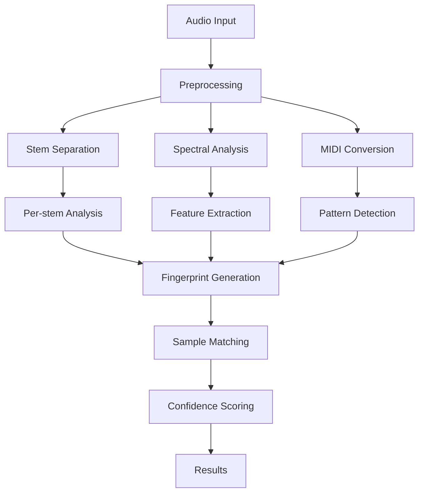

# 🧬 MusicDNA: Advanced Audio Sample Detection System

## 🎯 Core Concept: Natural Audio Decomposition
MusicDNA takes a revolutionary approach to sample detection by treating stems as a natural decomposition of music, similar to how Fourier transforms decompose signals into frequency components. Instead of trying to analyze complex mixed audio, we:

1. **Decompose Through Stems**:
   - 🥁 Drums: Rhythmic/percussion components
   - 🎸 Bass: Low frequency components
   - 🎤 Vocals: Melodic components
   - 🎹 Other: Remaining harmonics/instruments

2. **Dual Fingerprinting**:
   - 📊 Visual DNA: Spectrograms capture unique visual patterns
   - 🎼 MIDI DNA: Note patterns capture musical structure
   
3. **Natural Habitat Matching**:
   - Samples are matched in their native stem environment
   - Drum samples searched in drum stems
   - Melodic samples in their respective stems

This approach provides several key advantages:
- Natural isolation of sound components
- Clearer sample identification
- More efficient matching process
- Better handling of variations

## 🏗️ Technical Architecture

### Core Analysis Framework
1. **Spectral Analysis**
   - Multiple spectrogram representations:
     * Mel-spectrogram for perceptual analysis
     * STFT for frequency-time analysis
     * Chroma for harmonic content
   - Advanced frequency analysis
   - Energy distribution mapping

2. **Stem Analysis**
   - Source separation using Demucs:
     * Drums: Rhythm and percussion
     * Bass: Low-frequency content
     * Vocals: Melodic elements
     * Other: Additional instruments
   - Per-stem feature extraction
   - Independent confidence scoring

3. **MIDI Analysis**
   - Pattern detection using Basic Pitch
   - Note onset detection
   - Pitch contour analysis
   - Rhythmic pattern recognition

4. **Feature Extraction**
   - Temporal features:
     * Tempo estimation
     * Beat tracking
     * Onset strength
   - Spectral features:
     * Centroid
     * Rolloff
     * Bandwidth
   - Energy features:
     * RMS energy
     * Zero-crossing rate

### Analysis Pipeline


## 💫 Features

### Completed Features
✅ **Core Analysis**
- Advanced stem separation with GPU acceleration
- Comprehensive fingerprinting system
- Multi-level spectral analysis
- MIDI pattern extraction
- Detailed audio feature analysis

✅ **Performance**
- GPU acceleration support
- Efficient array operations
- Robust error handling
- Detailed logging system

✅ **User Interface**
- Interactive web interface
- Real-time analysis feedback
- Detailed visualization
- Comprehensive results display

### In Development
🚧 **Advanced Features**
- Transformation detection system
- Feature caching mechanism
- Parallel processing optimization
- Machine learning integration

🚧 **Visualization**
- Interactive spectrograms
- Stem visualization
- MIDI pattern display
- Match location timeline

## 🛠️ Technical Requirements

### Software Dependencies
```python
# Core Processing
librosa>=0.10.0        # Audio processing
numpy>=1.20.0          # Numerical operations
scipy>=1.9.0           # Signal processing

# Deep Learning
torch>=2.0.0           # GPU acceleration
basic-pitch>=0.2.6     # MIDI conversion
demucs>=4.0.0          # Source separation

# Visualization
matplotlib>=3.7.0      # Plotting
gradio>=3.50.2         # Web interface
plotly>=5.13.0         # Interactive plots

# Optional Enhancements
tensorboard>=2.11.0    # Performance monitoring
numba>=0.56.4          # Performance optimization
```

### Hardware Requirements
#### Minimum Requirements
- CPU: 4 cores, 2.5GHz+
- RAM: 8GB
- Storage: 2GB
- GPU: Optional

#### Recommended Specifications
- CPU: 8+ cores, 3.5GHz+
- RAM: 16GB+
- Storage: 5GB SSD
- GPU: CUDA-compatible, 8GB+ VRAM

### GPU Acceleration
The system automatically leverages GPU acceleration when available:
- CUDA 11.8+ compatible
- Automatic CPU fallback
- Multi-GPU support
- Configurable memory usage

## 📦 Installation

### Basic Installation
```bash
# Clone repository
git clone https://github.com/yourusername/musicdna.git
cd musicdna

# Create virtual environment
python -m venv venv
source venv/bin/activate  # Linux/Mac
# or
.\venv\Scripts\activate  # Windows

# Install dependencies
pip install -r requirements.txt
```

### GPU Support Installation
```bash
# Install CUDA toolkit (if not already installed)
# Visit: https://developer.nvidia.com/cuda-downloads

# Install PyTorch with CUDA support
pip install torch torchvision torchaudio --index-url https://download.pytorch.org/whl/cu118
```

### Optional Dependencies
```bash
# Install visualization dependencies
pip install plotly dash

# Install performance optimization tools
pip install numba tensorboard
```

## 🚀 Usage

### Starting the Application
```bash
# Basic start
python main.py

# With GPU memory optimization
CUDA_VISIBLE_DEVICES=0 python main.py

# With performance logging
MUSICDNA_DEBUG=1 python main.py
```

### Web Interface
1. Access the interface at `http://localhost:7860`
2. Upload audio files:
   - Sample clip (WAV, MP3, FLAC supported)
   - Full song for analysis
3. View analysis results:
   - Spectral visualizations
   - Confidence scores
   - Match locations
   - Transformation details

### API Usage
```python
from musicdna.core import StemAnalyzer

# Initialize analyzer
analyzer = StemAnalyzer()

# Create fingerprint
fingerprint = analyzer.create_sample_fingerprint(audio_data)

# Compare samples
matches = analyzer.compare_fingerprints(sample_fp, song_fp)
```

## 🔧 Development

### Project Structure
```
musicdna/
├── core/
│   ├── analyzers/
│   │   ├── base_analyzer.py      # Base analysis class
│   │   ├── stem_analyzer.py      # Stem separation & analysis
│   │   └── granular_detector.py  # Sample detection
│   ├── utils/
│   │   ├── audio_utils.py        # Audio processing utilities
│   │   ├── visualization.py      # Plotting functions
│   │   └── performance.py        # Optimization utilities
│   └── models/
│       ├── fingerprint.py        # Fingerprint models
│       └── confidence.py         # Scoring models
├── tests/
│   ├── test_analyzers.py
│   ├── test_utils.py
│   └── test_models.py
├── docs/
│   ├── API.md
│   ├── CONTRIBUTING.md
│   └── PERFORMANCE.md
├── main.py                       # Main application
├── requirements.txt
└── README.md
```

### Development Guidelines

#### Code Style
- Follow PEP 8 guidelines
- Use type hints
- Document all functions
- Write unit tests

#### Performance Optimization
- Profile code regularly
- Use GPU acceleration when possible
- Implement caching for repeated operations
- Optimize memory usage

#### Error Handling
- Implement comprehensive logging
- Use appropriate exception types
- Provide informative error messages
- Include fallback mechanisms

## 🤝 Contributing

### Getting Started
1. Fork the repository
2. Create a feature branch
3. Set up development environment
4. Make your changes
5. Run tests
6. Submit a pull request

### Pull Request Process
1. Update documentation
2. Add unit tests
3. Update requirements if needed
4. Request review from maintainers

## 📝 License
[MIT License](LICENSE)

## 🙏 Acknowledgments
- [Demucs](https://github.com/facebookresearch/demucs) for stem separation
- [Basic Pitch](https://github.com/spotify/basic-pitch) for MIDI conversion
- [Librosa](https://librosa.org/) for audio processing
- [Gradio](https://gradio.app/) for the web interface

## 📚 Additional Resources
- [API Documentation](docs/API.md)
- [Contributing Guidelines](docs/CONTRIBUTING.md)
- [Performance Guide](docs/PERFORMANCE.md)
- [Change Log](CHANGELOG.md)

## 🔗 Related Projects
- [Audio Source Separation](https://github.com/facebookresearch/demucs)
- [Music Information Retrieval](https://github.com/librosa/librosa)
- [MIDI Analysis](https://github.com/spotify/basic-pitch)

## 📧 Contact
- GitHub Issues: [Project Issues](https://github.com/yourusername/musicdna/issues)
- Email: your.email@example.com
- Twitter: [@yourusername](https://twitter.com/yourusername)

## 📈 Project Status
- Version: 1.0.0-beta
- Last Update: 2024-03-21
- Status: Active Development
